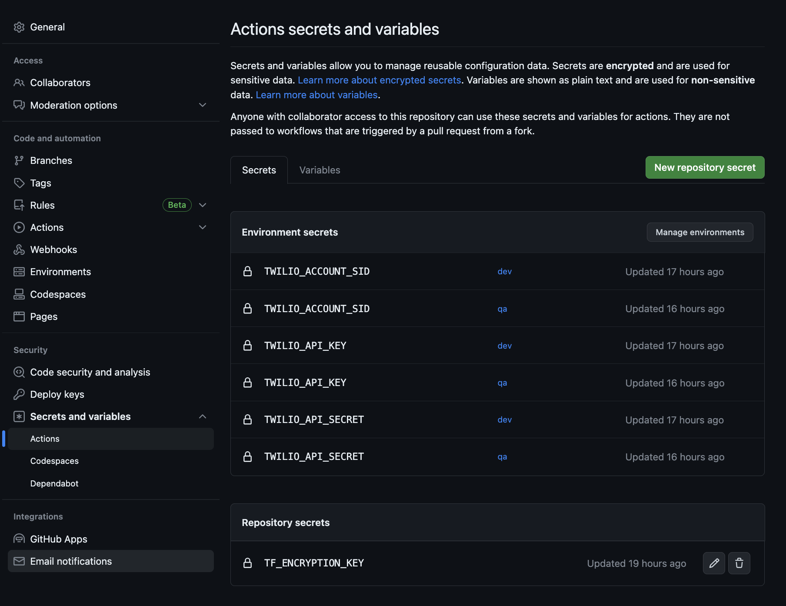

<a  href="https://www.twilio.com">

</a>
<br>
<br>

---

# Flex Project Template
The _Flex Project Template_ is a starting point for Flex solutions of any size.  It proposes recommendations around package structure and solution management.  It can be used for large projects or simple standalone features. 

You can have the solution running locally with little overhead or have a development pipeline setup without even doing a checkout.

The primary aims of this template are

1. To make iteratively building on Flex *easier*
2. Improve interoperability of plugin features by proposing some standardization
3. Massively accelerate project setup with options for asset and configuration versioning across multiple Twilio accounts

---

1. [Feature library Information](#feature-library-information)
2. [Setup Guides](#setup-guides)
    1. [Local Setup And Use](#local-setup-and-use)
        1. [Prerequisites](#prerequisites)
        2. [setup](#setup)
        3. [development notes](#development-notes)
    2. [Setup a project release pipeline](#setup-a-project-with-release-pipeline)
    3. [Deploying to hosted Flex without a release pipeline](#deploying-to-hosted-flex-without-a-release-pipeline)
    4. [Using template for a standalone plugin](#using-template-for-a-standalone-plugin)
3. [Why a template?](#why-a-template)
    1. [One Plugin](#one-plugin-instead-of-a-collection-of-plugins)
    2. [Package Structure](#when-working-with-one-plugin-we-need-a-package-structure-to-organize-our-code)
    3. [Versioning](#manage-serverless-functions-with-plugins-and-flex-configuration-in-once-place)
    4. [Typescript](#use-typescript)
4. [Okay, but why a template for a standalone plugin?](#okay-but-why-a-template-for-a-standalone-feature)
5. [Okay tell me more, what does it do exactly?](#okay-tell-me-more-what-does-it-do-exactly)
    1. [flex-config](#flex-config)
    2. [infra-as-code](#infra-as-code)
    3. [plugin-flex-ts-template-v1](#plugin-flex-ts-template-v1)
    4. [plugin-flex-ts-template-v2](#plugin-flex-ts-template-v2)
    5. [serverless-functions](#serverless-functions)
    6. [web-app-examples](#web-app-examples)
    7. [scripts](#scripts)
    8. [.github](#github)
6. [More Scripts Details](#more-scripts-details)
    1. [Removing Features](#removing-features)
    2. [Renaming Template](#renaming-template)
    3. [show-env-vars](#show-env-vars)
    4. [setup-local-environment](#setup-local-environment)
    5. [generate-env](#generate-env)
7. [Change log](#changelog)


## Feature library Information

| Feature | Description | Flex V1 Plugin |  Flex V2 Plugin | Enabled By Default |
| --------| ----------- | ------- | ----------| ----------- |
| Activity Reservation Handler | _synchronize agent activities to reservation states_ | [Yes](plugin-flex-ts-template/src/feature-library/activity-reservation-handler/README.md) | [Yes](plugin-flex-ts-template-v2/src/feature-library/activity-reservation-handler/README.md)|  | 
| Activity Skill Filter  | _manage visibility for activities based on agent skills_ | [Yes](plugin-flex-ts-template/src/feature-library/activity-skill-filter/README.md) | [Yes](plugin-flex-ts-template-v2/src/feature-library/activity-skill-filter/README.md) |  |
| Callbacks and Voicemail  | _introduce support for callback and voicemail tasks_ | [Yes](plugin-flex-ts-template/src/feature-library/callbacks/README.md) | [Yes](plugin-flex-ts-template-v2/src/feature-library/callback-and-voicemail/README.md) |  ✅ |
| Caller ID  | _provide agents with means to select their caller id when dialing out_ | [Yes](plugin-flex-ts-template/src/feature-library/caller-id/README.md) | [Yes](plugin-flex-ts-template-v2/src/feature-library/caller-id/README.md) | ✅ |
| Chat to Video Escalation  | _provide agents ability to elevate a chat conversation to a video conversation with screen sharing_ | No | [Yes](plugin-flex-ts-template-v2/src/feature-library/chat-to-video-escalation/README.md) |  |
| Chat Transfer  | _introduce chat transfer functionality for agents_ | [Yes](plugin-flex-ts-template/src/feature-library/chat-transfer/README.md) | [Yes](plugin-flex-ts-template-v2/src/feature-library/chat-transfer/README.md) |  |
| Conference (external) | _provide agents the ability to conference in external numbers_ | No | [Yes](plugin-flex-ts-template-v2/src/feature-library/conference/README.md) | ✅ |
| Device Manager | _provide agents the ability to select the audio output device_ | No | [Yes](plugin-flex-ts-template-v2/src/feature-library/device-manager/README.md) | ✅ |
| Dual Channel Recording | _automatically record both inbound and outbound calls in dual channel_ | No | [Yes](plugin-flex-ts-template-v2/src/feature-library/dual-channel-recording/README.md) |  |
| Enhanced CRM Container   | _optimize the CRM container experience_ | [Yes](plugin-flex-ts-template/src/feature-library/enhanced-crm-container/README.md) | [Yes](plugin-flex-ts-template-v2/src/feature-library/enhanced-crm-container/README.md) | ✅ |
| Hang Up By Reporting | _populates the Hang Up By and Destination attributes in Flex Insights_ | No | [Yes](plugin-flex-ts-template-v2/src/feature-library/hang-up-by/README.md) |  |
| Internal Call (Agent to Agent)  | _provide agents the ability to dial each other_ | No | [Yes](plugin-flex-ts-template-v2/src/feature-library/internal-call/README.md) |  |
| Multi-call | _allow agents to receive a transferred call while already on a call_ | No | [Yes](plugin-flex-ts-template-v2/src/feature-library/multi-call/README.md) |  |
| Override Queue Transfer Directory | _a template for modifying the transfer directories_ | [Yes](plugin-flex-ts-template/src/feature-library/override-queue-transfer-directory/README.md) | No |   |
| Omni Channel Management | _method for mixing chat and voice channels_ | [Yes](plugin-flex-ts-template/src/feature-library/omni-channel-capacity-management/README.md) | [Yes](plugin-flex-ts-template-v2/src/feature-library/omni-channel-capacity-management/README.md)|   |
| Pause Recording | _provide agents the ability to temporarily pause and resume call recording_ | No | [Yes](plugin-flex-ts-template-v2/src/feature-library/pause-recording/README.md) | ✅ |
| Schedule Manager | _a flexible, robust, and scalable way to manage open and closed hours for Twilio Flex applications_ | No | [Yes](plugin-flex-ts-template-v2/src/feature-library/schedule-manager/README.md) |  |
| Scrollable Activities | _allow the scrolling of the activities list_ | [Yes](plugin-flex-ts-template/src/feature-library/scrollable-activities/README.md) | [Yes](plugin-flex-ts-template-v2/src/feature-library/scrollable-activities/README.md) | ✅ |
| Supervisor Barge Coach | _introduce advanced supervisor barge and coach features_ | [Yes](plugin-flex-ts-template/src/feature-library/supervisor-barge-coach/README.md) | [Yes](plugin-flex-ts-template-v2/src/feature-library/supervisor-barge-coach/README.md) | ✅  |
| Supervisor Capacity | _allow supervisors to update worker capacity configuration within Flex_ | No | [Yes](plugin-flex-ts-template-v2/src/feature-library/supervisor-capacity/README.md) |  ✅ |
| Teams View Filters | _adds additional filtering options to the supervisor teams view_ | No | [Yes](plugin-flex-ts-template-v2/src/feature-library/teams-view-filters/README.md) | ✅  |

----

# Setup Guides

The following are guides to instruct the user how to leverage this template for each of the following use cases, they are focused around use of the flex V2 plugin.

## Local Setup and use

### Prerequisites
- you are running nodes v16 or above
- twilio cli 5.2.0 or above is [installed](https://www.twilio.com/docs/twilio-cli/getting-started/install) (`twilio --version`)
- twilio flex plugins 6.0.2 or above is [installed](https://www.twilio.com/docs/flex/developer/plugins/cli/install#install-the-flex-plugins-cli) (`twilio plugins`, `twilio plugins:install @twilio-labs/plugin-flex@latest`)
- twilio serverless plugin 3.0.4 or above is [installed](https://www.twilio.com/docs/labs/serverless-toolkit/getting-started#install-the-twilio-serverless-toolkit) (`twilio plugins` `twilio plugins:install @twilio-labs/plugin-serverless@latest`)
- `twilio profiles:list` has an active account set.
- have the twilio auth token for your account ready (you can find this in the [Twilio Console](https://console.twilio.com/))

### Setup
1. [Generate a new repository based on the template](https://github.com/twilio-professional-services/flex-project-template/generate)
2. Clone the new repository that you just created
3. make sure the twilio cli has the correct account set to active
```bash
twilio profiles:list
```
4. cd into the repository and execute the following (this installs all sub-project package dependencies and generates .env configuration for you)
```bash
npm install
```
5. follow the prompt and provide your auth token
6. Run the serverless functions and plugin locally by running (for Flex UI v1.x)
```bash
npm run start:local:v1
```
or (for Flex UI v2.x)
```bash
npm run start:local:v2
```
or if you have renamed your plugin (v2 only, this does not currently work for windows)
```bash
npm run start:local
```

### development notes
When developing locally, Flex config is overridden by anything in your [appConfig.js](/plugin-flex-ts-template-v2/public/appConfig.example.js).  Note: appConfig is only applicable when running the plugin locally, so you can edit this file to toggle features on and off for your locally running web server. You can also tweak the api endpoint for your serverless functions if you need to.

When running the plugin locally, this template has been set up to pair the plugin with the serverless functions also running locally on localhost:3001. The serverless functions can be debugged by attaching your debugger to the node instance.  The following is a sample entry for ".vscode/launch.json" to connect vscode for debugging

```json
{
  "version": "0.2.0",
  "configurations": [
    {
      "address": "localhost",
      "localRoot": "${workspaceFolder}/serverless-functions",
      "name": "Attach To Serverless Remote",
      "port": 9229,
      "remoteRoot": "${workspaceFolder}/serverless-functions",
      "request": "attach",
      "skipFiles": [
        "<node_internals>/**"
      ],
      "type": "node"
    }
  ]
}
```

---

## Setup a project with release pipeline

1. Use the template to create your own repository
2. Nominate a Twilio account to act as one of dev, qa, test, prod (based on your use case)
3. Create a twilio api key and secret for your account follow this [guide](https://www.twilio.com/docs/glossary/what-is-an-api-key#how-can-i-create-api-keys) to setup an API key.
    - If you intend to have multiple environments, you will need an API Key/Secret for each account.  You'll use this in the next step
4. In github, navigate to the repository you created in step 1, click the settings tab -> secrets -> actions -> Click the "New repository secret" button:
    - Add the following to select which plugin is released
        - `PLUGIN_FOLDER` - this is typically `plugin-flex-ts-template-v1` or `plugin-flex-ts-template-v2`
    - For each environment add the 3 env variables for that environment, for example, if its dev you would add
        - `TWILIO_ACCOUNT_SID_DEV` - the account sid you want to deploy to
        - `TWILIO_API_KEY_DEV` - the account key or key "sid" as its otherwise known
        - `TWILIO_API_SECRET_DEV` - the account secret



6. Login into Flex and make sure in the admin panel, the version of flex you are using meets the minimal version allowed by the plugin
7. _Optionally_ navigate to the flex console and enable the [Flex dialpad](https://console.twilio.com/us1/develop/flex/manage/voice?frameUrl=%2Fconsole%2Fflex%2Fvoice%3Fx-target-region%3Dus1) (this is required for some features)
8. Navigate over to github actions of your repository and select the environment you want to deploy, then run the workflow.
    - this will deploy the four assets to your environment with the default features enabled, See [Feature library Information](#feature-library-information) for further details of whats enabled by default.
    - serverless-functions will auto-identify any missing environment variables for the default features. It is recommended you populate the [environment variables](/serverless-functions/) for each account and manage config in version control at a later date to remove any ambiguity.
    - flex-config will auto-identify the domain name for the deployed serverless-functions and schedule-manager. It is recommended you populate the [ui_attributes](/flex-config/) config and manage the domain names through version control at a later date to remove any ambiguity. 
    - for full functionality, review the configuration steps for the disable features and make sure their dependencies are setup.

## Deploying to hosted Flex without a release pipeline

For the below steps, where `<environment>` is referenced, you may use `dev`, `test`, `qa`, or `prod`.

First, deploy the serverless functions:
```bash
cd serverless-functions
twilio serverless:deploy
```

If you plan to use the schedule manager feature, deploy its serverless functions as well:
```bash
cd ../serverless-schedule-manager
twilio serverless:deploy
```

Next, populate the serverless domains deployed above into the config:
```bash
cd ..
npm run populate-missing-placeholders <environment>
```

If you customized `custom_data` in `appConfig.js` while running locally, and would like to deploy with those settings, be sure to make the same changes in your `flex-config/ui_attributes.<environment>.json` file as well.

Deploy the configuration:
```bash
cd flex-config
npm run deploy:<environment>
```

Start the plugin deployment (example is v2, substitute for v1 if you're using v1):
```bash
cd ../plugin-flex-ts-template-v2
twilio flex:plugins:deploy --major --changelog "Initial deploy" --description "Flex project template"
```

After your deployment runs you will receive instructions for releasing your plugin from the bash prompt. You can use this or skip this step and release your plugin from the Flex plugin dashboard here https://flex.twilio.com/admin/plugins

For more details on deploying your plugin, refer to the [deploying your plugin guide](https://www.twilio.com/docs/flex/plugins#deploying-your-plugin).

# Using template for a standalone plugin

(Only applicable to v2 plugin)

1. Fork the template and give it a name
2. Install dependencies - you can skip when prompted to enter auth token
```bash
npm install
```
3. Remove the features; from the root folder of a checkout of your new repository run
```bash
npm run remove-features
```
4. Rename the template; from the root folder of a checkout of your new repository run
```bash
npm run rename-template <template-name>
```
5. Push your changes to your repository - this is your new baseline
6. You can follow the instructions for [local development setup](#local-setup-and-use) and then [adding a feature](/plugin-flex-ts-template-v2/README.md#adding-a-feature)


----

# Why a template?

*The Professional Services* team has worked with many customers since the original launch of Flex several years ago.  There are many ways to build with Flex but the collective experience has learned a few lessons that when followed, make working on Flex a lot easier.

### __One plugin instead of a collection of plugins.__

Working on flex with multiple plugins can work but as the number of plugins increases so does the likelihood that one plugin does something to the solution that another plugin was not expecting.  This can lead to some very difficult and time consuming troubleshooting.  By working on a single plugin, we can identify undesired behavior quickly and easily during development.

### __When working with one plugin we need a package structure to organize our code__

Working on a single plugin means that there is going to be a lot of code.  Therefore we need a package structure that allows developers to modularize their work but also easily pinpoint where their work overlaps with others.  This template proposes that package structure making distributed development across a team much easier.

### __Manage serverless functions with plugins and flex configuration in once place__

Ok it might seem obvious that you would want to do this but it might not be so obvious the most convenient way to do this, this template puts all those provisions in place so you can just get working on the features you want to build!

### __Use Typescript__

Although not strictly necessary, TypeScript immediately affords development teams improved readability and error checking.

# Okay, but why a template for a standalone feature?

We often see development teams that want to use solutions that are developed and publicly shared.  Typically these solutions are `Type B` [deliverables](#disclaimer).  As a result, consumers of these solutions often look to take ownership by rewriting the code and they typically start that by organizing the code into the package structure for a single plugin solution.  By following the template structure and **standardizing** the approach, it reduces the overhead for development teams to utilize the sample code and accelerates their ability to harden it for their own needs.

It also makes reuse of the serverless work that often gets re-written over and over again between plugins, minimizing overhead.

# Okay tell me more, what does it do exactly?

Well the template provides a means to version control the [Flex Configuration](#flex-config), [the plugin code](#plugin-flex-ts-template-v2) itself as well as the supporting [serverless functions](#serverless-functions).  There is also a solution to manage [task router configuration](#infra-as-code). The infrastructure as code is a bit more involved to setup and we are currently working on making that easier but there are guides available for the sample provided [here](https://www.twilio.com/blog/intro-to-infrastructure-as-code-with-twilio-part-1).  There is also an example yaml file for building a release pipeline using github actions.

The template comes with a [library of example features](#feature-library-information) that cover a lot of typical extensions to Flex.  These features can easily be turned on or off or simply just removed by leveraging the [scripts](#scripts) provided.  If you use the scripts to [remove all the features](#removing-features), you will be left with just the structure of the template plus some handy utilities and serverless functions.

You might be asking why would i want the serverless functions? Well you may be aware already, Twilio accounts have a maximum API concurrency limit of 100.  Some specific APIs have their own specific rate limit and so its [best practice](https://support.twilio.com/hc/en-us/articles/360044308153-Twilio-API-response-Error-429-Too-Many-Requests-) to handle the 429 responses that can come back.  The serverless functions provide an example of how to do this in the serverless and plugin layer.  There are also operations in there that improve the quality of the Flex solution, for example, you can update task attributes using an [ETAG](https://www.twilio.com/docs/taskrouter/api/task#task-version) to improve transaction safety and this isnt currently available on the front end sdk.

At the root of the repository you will find the following packages

- [flex-config](#flex-config)
- [infra-as-code](#infra-as-code)
- [plugin-flex-ts-template-v1](#plugin-flex-ts-template-v1)
- [plugin-flex-ts-template-v2](#plugin-flex-ts-template-v2)
- [serverless-functions](#serverless-functions)
- [serverless-schedule-manager](#serverless-schedule-manager)
- [web-app-examples](#web-app-examples)
- [scripts](#scripts)
- [.github](#github)

### **flex-config**

This package manages a json artifact that can be used to version configuration elements on a per-twilio-account basis. We can think of this as allowing us to configure, dev, qa, test, production or any other environments individually. This configuration relates specifically to the the configuration for flex discussed [here](https://www.twilio.com/docs/flex/developer/ui/configuration) and works by injecting the custom object into ui_attributes within the flex configuration object. The plugin is then able to reference these variables. The first example being, hosting the domain name of the associated serverless-functions.

*NOTE* changes are deep merged with whatever exists on the environment so existing configuration is preserved unless otherwise overridden by whats in version control.

More details on the flex-config package can be found [here](/flex-config/README.md);

### **infra-as-code**

This package is a legacy initiative to leverage pulumi in managing twilio configuration artifacts such as taskrouter entities. This package is a functional methodology and was setup to represent a typically vanilla flex account thats just been initialized. This package has not been maintained as the intention is to move towards a similar solution using the terraform provider, however what has been setup and used before is available for anyone looking to use it in the interim. More details on how to use this can be found [here](https://www.twilio.com/blog/intro-to-infrastructure-as-code-with-twilio-part-1). Currently there are no dependencies in this package that need to be used and is here only for reference. Feel free to remove this if not utilized.

### **plugin-flex-ts-template-v1**

This package is the actual flex plugin and a structure is already laid out that makes it a lot easier to work in a distributed development model. More details of the package structure are discussed [over here](plugin-flex-ts-template-v1/README.md) the plugin has a library of examples that can be turned on or off, or if desired can be removed completely with little overhead. The utilities in this package are designed around the associated serverless-functions and leverage the associated flex-config.

### **plugin-flex-ts-template-v2**

This package is identical in purpose to the `plugin-flex-ts-template-v1` except its intended for flex v2 projects which are discussed more [over here](plugin-flex-ts-template-v2/README.md). The intention is when kicking off a project or feature the owner would fork the repository or start a clean repository using the clone template function, then delete the plugin version they are not using.

### **serverless-functions**

This package manages the serverless functions that the _plugin-flex-ts-template_ is dependent on. In this package there are a suite of services already available to use, some of which are simply wrappers around existing twilio APIs but with added resilience around retrying given configurable parameters. These retry mechanisms are particularly useful when a twilio function needs to orchestrate multiple twilio APIs to perform an overall operation. It should be noted twilio functions still have a maximum runtime and therefore careful consideration of retries should be employed for each use case. This does however provide improved resiliency and performance when 429s, 412s or 503s occur.

### **serverless-schedule-manager**

This package manages the serverless functions specific to the _schedule-manager_ feature. This package is separate from the `serverless-functions` package due to the actual schedule manager configuration being part of this serverless package--the entire service is re-deployed upon each configuration publish. If you are deploying the schedule-manager feature, you will need to also deploy this package using the instructions in the [schedule-manager readme](plugin-flex-ts-template-v2/src/feature-library/schedule-manager/README.md). If you are not deploying the `schedule-manager` feature, this service will not be used and does not need to be deployed.

### **web-app-examples**

This package contains web application examples that build off feature functionality found within the plugin templates. These examples utilize building applications with `React` and interact with various endpoints within the `serverless-functions` package.

### **scripts**

this package maintains some convenience scripts namely

- [rename-template](#renaming-template) - for renaming the plugin and serverless packages along with the serverless domain, typically used when making standalone plugins that still want to follow the template structure
- [remove-features](#removing-features) - for removing the features from the template, again typically used when making standalone plugins that still want to follow the template structure


### **.github**

Lastly, this package manages the github action workflows - with one example being setup for a dev account where this template is maintained. Upon commits to _main_; _flex-config_, _plugin-flex-ts-template_ and _serverless-functions_ are all deployed on the associated environment, as controlled by the environment variables in github actions. The underlying scripts can easily be moulded for use in alternative release management tools.

---

# More Scripts Details

## Removing Features

(the following is only applicable when using the flex v2 plugin)

You may want to remove all the features in the template and just want to use the template skeleton and serverless utilities
 - You are starting a project and you don't want the features
 - You may be creating a standalone plugin with a targeted feature set

There is a convenience script available to do this.  After cloning the template, simply run the following command from the repository root dir.

```bash
npm install
npm run remove-features
```

---

## Renaming template

(the following is only applicable when using the flex v2 plugin)

**NOTE** *renaming the template will make it a little more challenging to merge further template updates later*

You may want to rename the plugin and the serverless dependencies
  - you are creating a standalone plugin and it needs to run side by side with other plugins using the template.

There is a convenience script available to do this.  After cloning the template, simply run the following command from the repository root dir.

```bash
npm install
npm run rename-template My-Feature-Name
```

It will
- rename the plugin to `ps-template-my-feature-name`
  - update the plugin filenames and code references to `MyFeatureName`
  - _the prefix ps-template is used to easily identify plugins using the template format_
- remove the flex v1 plugin (assuming its not to be used)
- rename the serverless-functions deployment name to `serverless-my-feature-name`
- reset the versions of these packages to `0.0.1`
- rename the variable used in flex-config to identify the serverless domain to `serverless_functions_domain_my_feature_name`
- rename references to the serverless domain within the plugin to match `serverless_functions_domain_my_feature_name`

## show-env-vars

convenience script for showing the SIDs of key services on your twilio account via the twilio cli

## setup-local-environment

convenience script for simplyfying local setup and development, triggered as part of an `npm install` at the root of the repository

## generate-env

convenience script that does the same as setup-local-environment except it won't install npm packages again.  Useful if you want to re-generate the serverless-functions env configuration from the current active profile in twilio-cli

# CHANGELOG
- 1.0.3
    - *BREAKING CHANGE* renamed plugin packages to plugin-flex-ts-template-v1 and plugin-flex-ts-template-v2 to explicitly separate plugins
    - updated README to account for v1 plugins in scripts
- 1.0.2
    - README updates
    - improved reliability of github actions scripts
    - update rename-template and remove-features to account for github actions scripts
    - defaulting plugin folder name for github action scripts to be the plugin-flex-ts-template-v2 plugin

- 1.0.1
    - Updated readmes with instructions for various use cases
    - Updated remove-features scripts to account for schedule manager
    - Modified plugin API strructure to leverage use of appConfig for easier local configuration
    - Updated github actions release scripts to attempt to infer environment variables if placeholders still in place
    - Updated github actions release scripts to break into multiple jobs decreasing the time taken to perform a release

