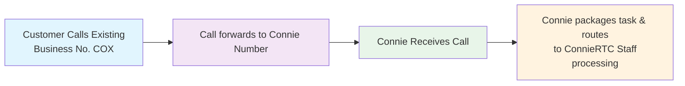

import Link from '@docusaurus/Link';

# Business Call Forwarding to Connie

## Introduction

We're excited to offer your nonprofit a modern, flexible call center experience using Connie—without requiring you to move your main business phone number from your current provider. Forwarding your business phone number allows you quickly and easily start leveraging most of Connie's features, while ensuring no disruption to your callers and minimal risk to your operations. 

Business call forwarding is a great way to kick off your Connie journey, but it is not recommended as a permanent setup. Please read on to learn more about how call forwarding works or contact the Connie Care team to discuss your strategy.

## How It Works

**The Process**:
- **Keep Your Main Number**: Your existing business number remains with your current provider
- **Forward Calls**: Your provider forwards all incoming calls to a new Connie number
- **Answer in Connie**: Your team answers calls within Connie's platform, leveraging advanced features tailored for nonprofit efficiency
- **Outbound Calls**: Your main number appears as the caller ID for outbound calls, maintaining consistency
- **Seamless Integration**: Experience all of Connie's features without disrupting your existing phone setup

## Detailed Steps for Call Forwarding to Connie

To forward your current business number to Connie, you'll need to either **PORT** the number to Connie or **FORWARD** calls from your existing provider to your Connie number. 

If porting isn't an option yet, or you wish to take a more staged approach to your Connie transition, you can set up call forwarding through your existing provider, directing calls to your Connie number. Connie also allows you to configure call forwarding rules within your account, including setting specific forwarding numbers and ring times.

## View Specific Business Call Forwarding Instructions by Provider

Choose your current phone provider below to view step-by-step forwarding instructions:

  
  

    

      <Link to="/end-users/cbo-admins/voice/call-forwarding/cox-communications">
        
      </Link>
    

    <Link to="/end-users/cbo-admins/voice/call-forwarding/cox-communications" style={{textDecoration: 'none', fontWeight: 'bold'}}>
      Setup Guide Available
    </Link>
  

  

    

      <Link to="/end-users/cbo-admins/voice/call-forwarding/xfinity-business">
        
      </Link>
    

    <Link to="/end-users/cbo-admins/voice/call-forwarding/xfinity-business" style={{textDecoration: 'none', fontWeight: 'bold'}}>
      Setup Guide Available
    </Link>
  

  

    

      
    

    
      Setup guide coming soon
    
  

  

    

      
    

    
      Setup guide coming soon
    
  

*Don't see your provider? Contact the Connie Care team for assistance with your specific setup.*

## Important Considerations

### Before You Begin
- ✅ Verify your current provider supports call forwarding
- ✅ Confirm any additional charges for call forwarding
- ✅ Have your Connie phone number ready (provided by your administrator)
- ✅ Test during off-peak hours to minimize disruption

### Potential Limitations
- **Call Quality**: Some providers may compress forwarded calls
- **Feature Compatibility**: Certain advanced features may not work with forwarded calls
- **Cost**: Additional charges may apply for call forwarding
- **Reliability**: Forwarding depends on your current provider's service stability

### Recommended Timeline
1. **Week 1**: Set up forwarding and test basic functionality
2. **Week 2-3**: Train staff on Connie platform features
3. **Week 4+**: Evaluate performance and consider porting number directly to Connie

## Next Steps

After setting up call forwarding:
1. **Test Your Setup**: Make test calls to ensure forwarding works correctly
2. **Train Your Team**: Familiarize staff with Connie's interface and features
3. **Monitor Performance**: Track call quality and any issues
4. **Plan for Porting**: Consider moving your number directly to Connie for full features

## Need Help?

**Connie Care Team**: Contact us for personalized assistance with your call forwarding setup

**Technical Support**: Available for troubleshooting and configuration questions

**Training Resources**: Access our comprehensive guides for maximizing your Connie experience

---

*Call forwarding is a temporary solution to help you get started with Connie quickly. For the full range of features and optimal performance, we recommend porting your number directly to Connie when you're ready.*