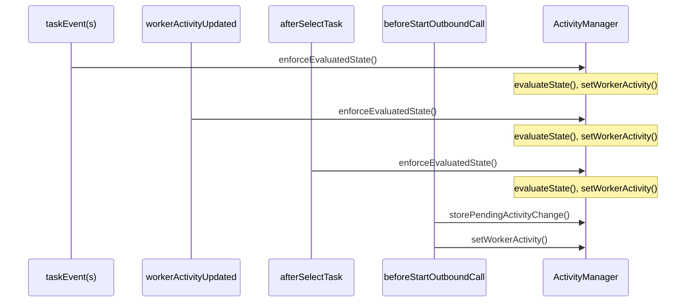

## Overview

This feature synchronizes the agent's [TaskRouter Activity](https://www.twilio.com/docs/taskrouter/api/activity) with the state of the tasks they are working on.

---

## Business Use Case

In many typical legacy contact centers there is a concept of an [Aux Code](https://cxcentral.com.au/glossary/auxiliary-codes/) which is used to track the reason that an agent is not receiving work from the Automatic Call Distributor (ACD). This Aux code includes explicitly distinguishing when an agent is on a live task and when an agent is in wrap up.

Twilio TaskRouter models things slightly differently. An agent's [Activity](https://www.twilio.com/docs/taskrouter/api/activity) is the concept in TaskRouter that manages availability for the agent to receive the next item of work.  This Activity status does not change throughout the life cycle of a task.  In Twilio Flex, reporting on an agent's productivity is typically done via the examining the lifecycle of the tasks worked.

This paradigm shift can be a difficult one for legacy contact centers to adopt when migrating to Twilio Flex so this feature aims to make that easier by introducing a mechanism to automatically sync the agent Activity with the status of the work the agent is handling. This can aid with reporting strategies.

## Known Issues

### issue one
Flex places a limitation on changing Activity while a task is in a pending state.  In other words, if a task has been pushed to the agent but the agent has not accepted, then Flex can only change Activity to an offline Activity which will reject the task.

As a result, while a pending task appears in an agents task list, toggling between tasks will not update the Activity.  For this reason it is recommended to use this feature along with an [agent automation](/flex-project-template/feature-library/agent-automation) to auto accept tasks.

### issue two
Flex allows supervisors to move the Activity of an agent from the Supervisor Teams View.  Doing so pushes an Activity update to the worker which triggers the event `workerActivityUpdated` on the agent's client, which in turn triggers a re-evaluation of the correct state to be in, again on the client side. This has two drawbacks:
1. The agent will be in the wrong state for a second
2. If the agents client is not running, there will be nothing to process the event and could end up in an erroneous state.

For this reason, when using this feature, you may want to consider moving the logic to a backend solution when ultimately evaluating the Activity change.

## Flex User Experience

## Setup and Dependencies

This feature depends on the configured Activities for the different ACD states.  A terraform deploy will deploy the default Activities that are assigned. These can be changed through the admin panel at any time.

## Technical Details

### high level implementation
This feature initializes a helper class called `ActivityManager` which exposes a method called `enforceEvaluatedState`.  This method evaluates the current tasks in flight to determine which, if any, Activity the worker should be forced onto, or whether they should be moved to their pending state.  If the worker wishes to move to a new activity while they have tasks in flight, the activity will be suspended until it can be performed automatically after tasks have been completed.

This method is triggered on `taskAccepted` event as well as the various end state events for the workerClient, namely `taskCanceled`, `taskCompleted`, `taskRejected`, `taskRescinded`, `taskTimeout`, `taskWrapup` as well as `workerActivityUpdated`.  It is also triggered on `SelectTask` and `SetActivity`.

The `enforceEvaluatedState` method uses a semaphore to ensure only one update is performed and completed at a time, completion includes the confirmation that the state has been updated which can wait up to a maximum of 3000ms to confirm the state update before posting a warning and continuing.  Subsequent updates requested while the process is running are added to an array and executed in order received.

It is due to this blocking operation that when starting an outbound call, an attempt to change the state when the task is pending can cause the outbound call to abandon.  This is why the `taskReceived` event is omitted from the events listed above.  Instead we use the `beforeStartOutboundCall` to move the agent into the appropriate activity first.

### sequence diagram

