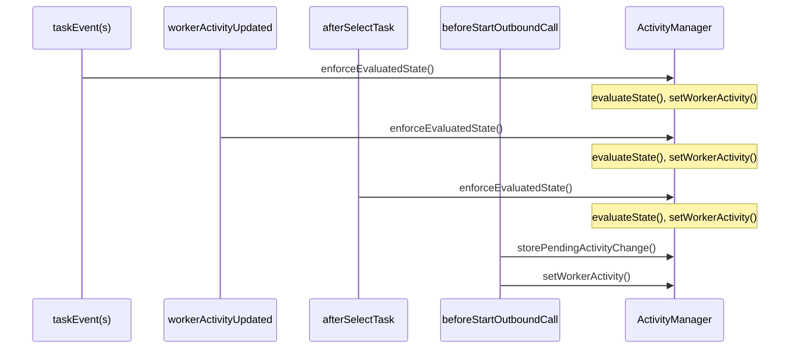

import Tabs from "@theme/Tabs";
import TabItem from "@theme/TabItem";

## Overview

This feature synchronizes the agent's [TaskRouter Activity](https://www.twilio.com/docs/taskrouter/api/activity) with the state of the tasks they are working on.


---

## Business Details

### context
In many typical legacy contact centers there is a concept of an [Aux Code](https://cxcentral.com.au/glossary/auxiliary-codes/) which is used to track the reason that an agent is not receiving work from the Automatic Call Distributor (ACD). This Aux code includes explicitly distinguishing when an agent is on a live task and when an agent is in wrap up.

Twilio TaskRouter models things slightly differently. An agent's [Activity](https://www.twilio.com/docs/taskrouter/api/activity) is the concept in TaskRouter that manages availability for the agent to receive the next item of work.  This Activity status does not change throughout the life cycle of a task.  In Twilio Flex, reporting on an agent's productivity is typically done via the examining the lifecycle of the tasks worked.

This paradigm shift can be a difficult one for legacy contact centers to adopt when migrating to Twilio Flex. 

### objective
This feature aims to make such a shift easier by introducing a mechanism to automatically sync the agent Activity with the status of the work the agent is handling. This can aid with reporting strategies.

### other comments
Given it is not desirable to select the system activities, the [agent skill filter](/flex-project-template/feature-library/activity-skill-filter) is a useful feature to enable in unison with this one.  This feature will allow you to effectively hide the system activities from view.

## Known Issues

### issue one
Flex places a limitation on changing Activity while a task is in a pending state.  In other words, if a task has been pushed to the agent but the agent has not accepted, then Flex can only change Activity to an offline Activity which will reject the task.

As a result, while a pending task appears in an agents task list, toggling between tasks will not update the Activity.  For this reason it is recommended to use this feature along with an [agent automation](/flex-project-template/feature-library/agent-automation) to auto accept tasks.

### issue two
Flex allows supervisors to move the Activity of an agent from the Supervisor Teams View.  Doing so pushes an Activity update to the worker which triggers the event `workerActivityUpdated` on the agent's client, which in turn triggers a re-evaluation of the correct state to be in, again on the client side. This has two drawbacks:

1. The agent will be in the wrong state for a second
2. If the agents client is not running, there will be nothing to process the event and could end up in an erroneous state.

The reason we cannot change the agent's state directly to the correct resolved state is because we have no direct access to update the pending state on the agents local storage.  To accomplish this a future update will be required to leverage a different messaging schema that can trigger the evaluation on the agents side.

## Flex User Experience


## Configuration Options and Dependencies

### configuration options

```json
{
  "activity_reservation_handler": {
    "enabled": false,
    "system_activity_names": {
      "available": "Available",
      "onATask": "On a Task",
      "onATaskNoAcd": "On a Task, No ACD",
      "wrapup": "Wrap Up",
      "wrapupNoAcd": "Wrap Up, No ACD",
      "extendedWrapup": "Extended Wrap Up"
    }
  }
}
```

This feature depends on a configured set of Activities for the different ACD states. After [enabling](/building/template-utilities/configuration#configuration-management) the feature the following configuration is required

The following are the descriptions of the configuration objects and what they represent 

#### system_activity_names

this object allows the administrator to customize which activity names to use for each system state that the feature enforces.

- **available**:  this variable represents the name of the activity to set when the system needs to move the agent to a "default" available status. This would only happen as part of an unexpected, exception handling scenario.
- **onATask**:  this variable represents the name of the activity to set when the system needs to move the agent to a state representing they are available for work and are currently handling a task
- **onATaskNoAcd**:  this variable represents the name of the activity to set when the system needs to move the agent to a state representing they are not available for work but are currently working a task.
- **wrapup**:  this variable represents the name of the activity to set when the system needs to move the agent to a state representing they are available for work and are currently in after call work
- **wrapupNoAcd**:  this variable represents the name of the activity to set when the system needs to move the agent to a state representing they are not available for work but are currently in after call.
- **extendedWrapup**: this variable represents the name of the activity to set when the `ExtendWrapUp` action is invoked by an agent requesting extended wrap up via the `agent-automation` feature.

### dependencies

#### terraform

A terraform deploy will deploy the default Activities that are assigned. If you wish to change these you can [modify the terraform definitions](/building/template-utilities/terraform) to create the activities you wish to use and you can modify the feature configuration using your preferred [configuration management](/building/template-utilities/configuration) method.

#### manual setup 

If you are not using terraform you can create the activities manually in the [console](https://twilio.com/console).  You can then modify the feature configuration using your preferred [configuration management](/building/template-utilities/configuration) method.

## Custom Changes

_this section is a placeholder for documentation of any changes performed over and above the original template implementation_


## Technical Details

### high level implementation

#### inbound tasks, selecting tasks and selecting activity

This feature initializes a helper class called `ActivityManager` which exposes a method called `enforceEvaluatedState`.  This method evaluates the current tasks in flight to determine which, if any, Activity the worker should be forced onto, or whether they should be moved to their pending state.  If the worker wishes to move to a new activity while they have tasks in flight, the activity will be suspended until it can be performed automatically after tasks have been completed.

This method is triggered on taskrouter events that could signal a necessary state change.  It is also triggered on `SelectTask` and as part of `SetActivity`. 

The `enforceEvaluatedState` method uses a semaphore to ensure only one update is performed and completed at a time.  Subsequent updates requested while the process is running are added to an array and executed in order received.  This avoids any errors thrown because an activity state change is pending.

#### outbound tasks

When an outbound call is placed it remains in a `pending` state until the call is answered, when it is answered it moves to an `accepted` status. As an exception case to [typical pending task behavior](https://assets.flex.twilio.com/docs/releases/flex-ui/latest/ui-actions/Actions#SetActivity) __no__ activity state is possible while an outbound call is in a `pending` state, which is the time the call is ringing.

As we want to place a worker into a variant of the `On A Task` activity while the call is ringing, we use the `beforeStartOutboundCall` to move the agent into the appropriate activity before placing the call. Note [Known Issue 1](#issue-one).

#### supervisor worker updates

As vanilla Flex enables a supervisor to move an agents activity from the TeamsView.  It is possible for such a change to interfere with the agents-Activity correctly reflecting the agents tasks-in-flight.  Although "system activities" such as `On A Task` are rejected if the supervisor tries to select them.  To preserve existing functionality, non "system activities" are not.  The state change will be pushed and the `workerActivityUpdated` event handler on the agents side will then push the agent back into the correct "system activity" they are supposed to be in. Note [Known Issue 2](#issue-two). If a supervisor wishes to move an agent to a non "system activity" while the agent has tasks in flight, the agent will first need to make sure the tasks are completed.  This can be accomplished by enabling the [supervisor-complete-reservation](/feature-library/supervisor-complete-reservation) feature.


### sequence diagram



### flex hooks

<Tabs>
<TabItem value="events" label="Event Hooks" default>

| Event Name | Description |
| --------- | ----------- |
| taskAccepted | triggers ActivityManager.enforceEvaluatedState() |
| taskCanceled | triggers ActivityManager.enforceEvaluatedState() |
| taskCompleted | triggers ActivityManager.enforceEvaluatedState() |
| taskRejected | triggers ActivityManager.enforceEvaluatedState() |
| taskRescinded | triggers ActivityManager.enforceEvaluatedState() |
| taskTimeout | triggers ActivityManager.enforceEvaluatedState() |
| taskWrapup | triggers ActivityManager.enforceEvaluatedState() |
| workerActivityUpdated | triggers ActivityManager.enforceEvaluatedState() |

</TabItem>

<TabItem value="actions" label="Action Hooks">

| Action Hook | Action Name | Description |
| ----------- | ----------- | ----------- |
| after | ExtendWrapUp | triggers ActivityManager.enforceEvaluatedState() |
| after | SelectTask | triggers ActivityManager.enforceEvaluatedState() |
| before | SetActivity | triggers ActivityManager.enforceEvaluatedState(), ActivityManager.storePendingActivityChange() |
| before | StartOutboundCall | triggers ActivityManager.storePendingActivityChange, ActivityManager.setWorkerActivity(newActivity) |
| before | SetWorkerActivity | blocks system activities, ActivityManager.enforceEvaluatedState(), ActivityManager.storePendingActivityChange(selectedActivity) |

</TabItem>

<TabItem value="component" label="Component Hooks">

| Component Hook | Component Name | Options | Related Custom Component | Description |
| -------------- | -------------- | ------- | ----------------------- | ----------- |
| add            | MainHeader     | `sortOrder: -999`, `align: 'end'` | PendingActivityComponent | Adds a visual indicator of any pending activity change that will be executed once all tasks are completed |

</TabItem>
</Tabs>


