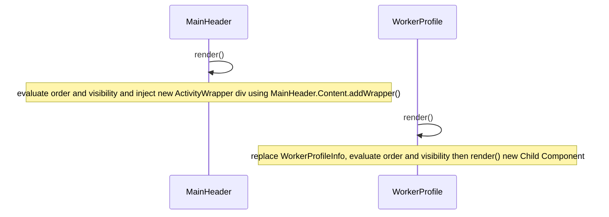

import Tabs from "@theme/Tabs";
import TabItem from "@theme/TabItem";
import Enabled from '/img/features/activity-skill-filter/feature-enabled.png';
import Disabled from '/img/features/activity-skill-filter/feature-disabled.png';

## Overview

This feature allows administrators to configure visibility of Agent Activities based on skills, as well as ordering the Activities in the Activities drop down menu.

---

## Business Details

### context
It is not uncommon to create Activities that should only ever be used or set programmatically.  

It might also be the case that only certain users should be able to set particular Activities.  

Although minor it is also a common request for agents to see the most frequently used Activities first in the drop down menu.

### objective
This feature aims to address these needs by providing the administrator the ability to lock down Activities by skill as well as ordering them based on a set order then alphabetically.

## Known Issues

### issue one
On older Twilio Flex accounts a TaskRouter Activity of "Reserved" may be present. This Activity is automatically hidden by the Flex UI and breaks the logic of the plugin. In this scenario it is advised you remove any TaskQueue references to the "Reserved" activity (which will likely be the activity to use when task is assigned on the TaskQueue and as such isn't actually used by Flex) and then delete the "Reserved" Activity.

## Flex User Experience

The following example images show the behavior of the Activity skill filter might behave when the system Activities from [activity reservation handler](/flex-project-template/feature-library/activity-reservation-handler) are hidden using non-existent skills and the `Offline` Activity is set to last position.  As can be seen, the other Activities are ordered alphabetically.

| With Feature   | Without Feature  |
| -------------- | ---------------- | 
| | |

## Configuration Options and Dependencies

### configuration options

```json
"activity_skill_filter": {
  "enabled": true, // controls whether this feature is enabled
  "filter_teams_view": true, // controls whether this feature affects the Teams view WorkProfile activity menu
  "rules": {
    "<ACTIVITY_NAME_OR_SID>": {
      "required_skill": "skill_name", // name of skill required to allow this activity, or null to allow all workers
      "sort_order": order // zero-based integer
    }
  }
}
```

This feature depends on a configured set of rules for the different Agent Activities. After [enabling](/setup-guides/configure_the_template#the-data-model) the feature the following configuration is required

The following are the descriptions of the configuration objects and what they represent 

**filter_teams_view**: this variable represents whether or not to override the supervisor teams view, also applying the filters and sort order to the worker profile screen when viewing workers.

#### rules

this object allows the administrator to customize which activities are associated with which skills and what order they should appear in

- **<ACTIVITY_NAME_OR_SID>**:  this element name represents the name of the activity or the SID of the activity for which you want to set a rule

#### activity_name_or_sid

- **required_skill**: this variable represents the skill name that is required to see the activity in the drop down menu.  It can be set to `null` for no skill required or a non-existent skill to make sure no agent can manually select it.
- **sort_order**: this variable represents the order the activity should appear in the drop down menu, if two items have the same sort_order they will be ordered alphabetically.  This value should be zero or greater.

#### example

```json
{
"activity_skill_filter": {
  "enabled": true,
  "filter_teams_view": true,
  "rules": {
    "Available": {
      "required_skill": null,
      "sort_order": 0 // will appear first
    },
    "Outbound Calls": {
      "required_skill": "outbound_calls",
      "sort_order": 1 // will appear second
    },
    "Offline": {
      "required_skill": null,
      "sort_order": 100 // will appear last
    }
  }
}
}
```

### dependencies

There are no dependencies for this feature to work.

## Custom Changes

_this section is a placeholder for documentation of any changes performed over and above the original template implementation_


## Technical Details

### high level implementation

#### deriving the rules

This feature provides a helper class `AgentActivities` that exposes a method that loops through all the possible activities and matches them to the provided rules.  If no rules are provided, then they are assumed to be visible with a sort order of 0 (meaning they will appear at the start, sorted alphabetically).

This method is also used to generate an array of a custom object `ActivityCssConfig` that contains an index id, a visible flag and an order flag.  The index is matched to the original order of the activities list.

#### MainHeader

A new react component is created called `ActivityWrapper` that is used to wrap around the original `MainHeader` [component](https://assets.flex.twilio.com/docs/releases/flex-ui/2.3.3/programmable-components/components/MainHeader/) and all the new component does is add a div around the MainHeader, the div allows us to inject css that targets the lower level components to override them.  We pass in the array of `ActivityCssConfig` objects we generated earlier and we use the index id to find the Activity buttons on the menu drop down and apply a visibility flag and an order flag.

#### WorkerProfile

A new react component called `WorkerProfileInfo` is created that uses the `AgentActivities` class to generate a list of eligible activities and their order.  It is then used to render this new component that replaces the `info` child component on the `WorkerProfile` [component](https://assets.flex.twilio.com/docs/releases/flex-ui/2.3.3/programmable-components/components/WorkerProfile/).


### sequence diagram



### flex hooks

<Tabs>
<TabItem value="component" label="Component Hooks" default>

| Component Hook | Component Name | Options | Related Custom Component | Description |
| -------------- | -------------- | ------- | ----------------------- | ----------- |
| addWrapper     | MainHeader     |         | ActivityWrapper         | Wraps MainHeader with a div that injects css, targeting lower level components |
| replace        | WorkerProfile.info | `align: 'start', sortOrder: 2` | WorkerProfileInfo | replaces info panel on WorkerProfile so activities can be directly controlled so sort and filter based on skills |

</TabItem>
</Tabs>
