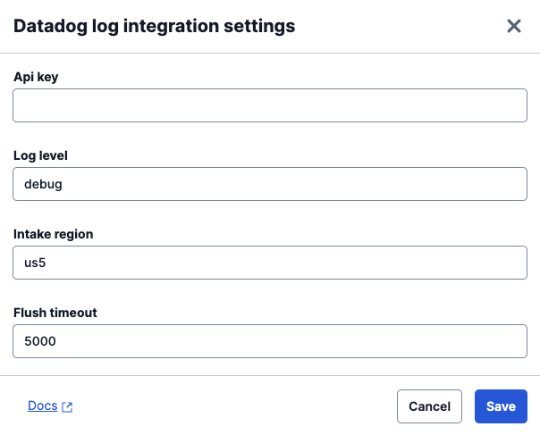

This feature forwards logs emitted by the Flex Project Template to Datadog.

### Configuration

This feature allows the following configuration settings.

| Setting | Description |
| --------| ------------|
| Api key | Your Datadog Account [client token](https://docs.datadoghq.com/account_management/api-app-keys/#client-tokens)
| Log Level | The minimum log level to send to Datadog. See [Logging](/flex-project-template/building/template-utilities/logging) for more details.
| Intake Region | The [Datadog Site](https://docs.datadoghq.com/getting_started/site/) for your account. Valid values are `us` | `us5` | `us3` | `eu`.
| Flush Timeout | In milliseconds. Because we send logs to datadog over HTTP - we do not want to make an HTTP request for every log written. This feature will buffer log messages for the flush timeout before making a single HTTP request to Datadog with all buffered log messages. If there are no logs within the Flush timeout, there is no HTTP request to Datadog. |

### Flex User Experience

Logs are forwarded automatically with no indication to the Flex User.

### Dependencies

You will need a Datadog account, with a [client token](https://docs.datadoghq.com/account_management/api-app-keys/#client-tokens), as well as your intake region, or [Datadog Site](https://docs.datadoghq.com/getting_started/site/).

_Client tokens are safe for use in browsers._

### Metadata

All logs sent to Datadog are decorated with common metadata. In this case, we add the worker name and workerSid to every log message sent to Datadog automatically!

### Note

Logs are forwarded to Datadog through HTTP, not the datadog sdk client. This is done to save build size of the template. If you're looking for a tighter integration with Datadog, consider a custom feature that implements their client sdk.
