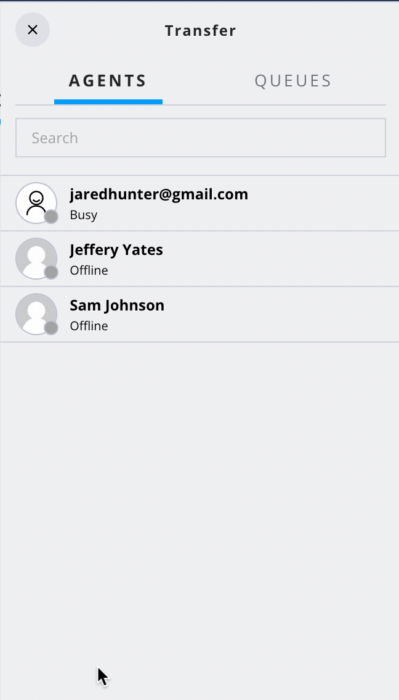

# override-queue-transfer-directory

This feature replaces the full queue transfer directory panel allowing for easy customization of which queues to show.

Typically we want to filter the queue list based on some criteria, this allows us to inject that logic into the view. A common pattern is to use a naming convention for queues, this component exposes a prop to ensure all queues contain the matching string. Alternatively, other logic might be used, this affords the ability to inject that logic.

this component also exposes the ability to modify the UI, by default it uses a different icon as this feature is primarily used for chat but it could just as easily be modified to render however is desired.

# flex-user-experience

# setup and dependencies

There are no dependencies for setup beyond ensuring the flag is enabled within the flex-config attributes.

# how does it work?

The component mimics the behavior of the OOTB queue directory, It should be noted a list of queues is generated from the real time stats data and not from the tr-queue sync index, as OOTB uses. This will only cause differences in behavior if the queue hasnt recieved events for 30 days. In this scenario, the OOTB queue list wont show the queues, whereas this feature will. Upon selection of a queue, a TransferTask event is invoked using the data from the selected queue. As this follows the interface for producing the event, any downstream logic should work seamlessly.
