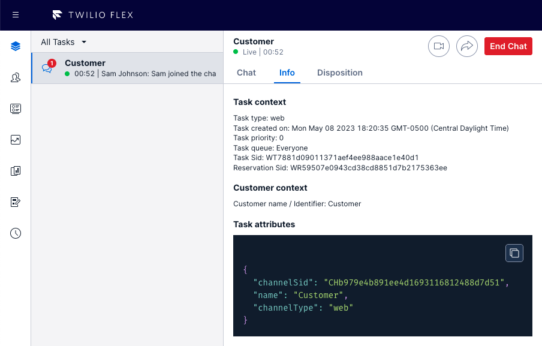

# attribute-viewer

This feature displays task attributes in the task info tab, and displays worker attributes in the teams view worker panel.

# flex-user-experience



# setup and dependencies

There are no additional dependencies for setup beyond ensuring the feature is enabled within the `flex-config` attributes.

To enable the attribute viewer feature, under your `flex-config` attributes set the `attribute_viewer` `enabled` flag to `true`:

```json
"attribute_viewer": {
    "enabled": true
}
```

# how does it work?

This feature uses a Twilio Paste code block component to display task and worker attributes passed via component props.
