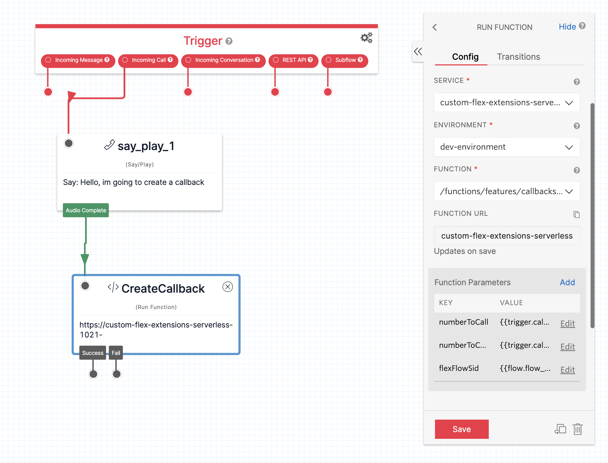

# callbacks and voicemail

This feature enables the use of callbacks and voicemails as a custom task type.  It is a generic version intended to accelerate the customization of such a feature for any particular project, providing the main parts of a callback feature in easy to understand and customizable way.  It is inspired by the work in the [twilio solution library](https://www.twilio.com/docs/flex/solutions-library/queued-callback-and-voicemail) however it has a few key aspects that make it a little easier to use

- the callbacks are placed on the voice channel by default, as its typical projects want callbacks to be threaded in single file with voice calls.
- there is an API for creating the callback so you just have to create your customer experience then decide when to create the callback instead of peeling apart the sample solution.
- [creating a callback](../../../../serverless-functions/src/functions/features/callbacks/studio/create-callback.protected.js#L68) has a little more resiliency built in as it uses a retry handler.
- callbacks and voicemails use a shared set of components and functions, as voicemails are effectively callbacks with a voicemail recording attached
- maximum attempts are configurable
- the callback task can be automatically selected after the outbound call back to the contact ends

# flex-user-experience

the vanilla feature without any further customizations will look like this for callbacks

voicemails will look like this

# setup and dependencies

Creating a callback involves creating a task with at a minimum a number to callback and a number to call from.  A sample setup of that is shown here in a studio flow where a number has been wired up to immediately create a callback and hang up.

here you can see three parameters which are populated from the studio flow

- numberToCall: {{trigger.call.From}} - the number the customer dialed from
- numberToCallFrom: {{trigger.call.To}} - the number the customer tried to dial
- flexFlowSid: {{flow.flow_sid}} - to capture the entry point of this callback, it is stored on the task

This serverless function can be used from anywhere, not just the studio flow, to create a callback task.

The creation of a task requires a workflow.  You may create a custom workflow, that uses some collected data to organize the tasks into different queues or maybe something more complex.  You may also just want to use the default "Assign To Anyone" workflow that is spawned on a vanilla flex instance.

Once you have decided which workflow you are using, you simply reference it in the environment file for your serverless-functions and make sure it is deployed as well as ensuring the flag is set for the feature in flex-config and that, that is also deployed.  You now have a functioning callback feature!

the variable that you need to make sure is set is
>TWILIO_FLEX_CALLBACK_WORKFLOW_SID=WW....

Creating a voicemail involves the same setup as above, however the following additional parameters must be passed to the create-callback function from a Record Voicemail widget:

- recordingSid: {{widgets.record_voicemail_1.RecordingSid}} - the recording SID from the Record Voicemail widget
- recordingUrl: {{widgets.record_voicemail_1.RecordingUrl}} - the recording URL from the Record Voicemail widget

# how does it work?

The feature works be registering custom flex channels for callbacks and voicemails.  These channels are a presentation only layer, on top of the taskrouter channel, which remains voice.

when the channel is registered, it renders custom components based on the task attribute; _taskType: callback_ or _taskType: voicemail_

there are two associated serverless functions called _create-callback_

the only difference between these functions is one is intended to be called from flex, the other from anywhere else but typically studio.  The difference is the security model for each function but both do the same thing, taking in task attributes and generating a new callback task.  The flex interface is used for the re-queueing feature.
