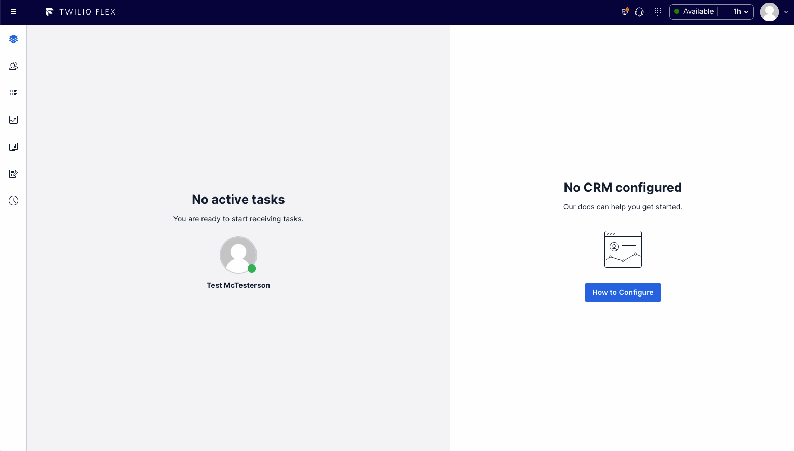

# Internal call

This feature adds a new "Call Agent" section to the outbound dialpad allowing an agent to directly call another agent. In this section, there is an autocomplete dropdown where you can select an available agent you want to call.

# setup and dependencies

## Outbound Call Configuration

When placing the internal call, the default outbound call settings are used. If this has not yet been configured, you will encounter errors. This can be configured in the Twilio Console > Flex > Manage > Voice.

## Call Target

When placing a call from Flex, it must be to a phone number or SIP address. Therefore, a phone number or SIP address is needed for the sole purpose of establishing the call.

For simplicity sake, let's set an unused Twilio phone number as the call target. A phone number can be purchased in the Twilio Console if you do not have an unused one available. In the serverless-functions package, a webhook is deployed which will immediately disconnect the call. This webhook must be assigned to the phone number as follows:

1. Open Twilio Console > Phone Numbers > Manage > Active Numbers
2. Select the desired unused phone number
3. In the 'Voice & Fax' section, configure a webhook as follows:
  - Accept incoming: Voice Calls
  - Configure with: Webhook, TwiML Bin, Function, Studio Flow, Proxy Service
  - A call comes in: Function
  - Service: custom-flex-extensions-serverless _(the name of the service deployed from the serverless-functions package)_
  - Environment: dev-environment
  - Function path: /features/internal-call/common/call-silence
4. Click Save

In your flex-config, set the `call_target` setting under the `internal_call` feature to the phone number configured above.

# How does it work?

After selecting and clicking the call button, the WorkerClient's createTask method is used to create the outbound call task having the phone number configured above as target. When the task is sent to the agent, the AcceptTask action is overridden to immediately warm transfer the task to the desired called agent. This establishes a call between the two agents.