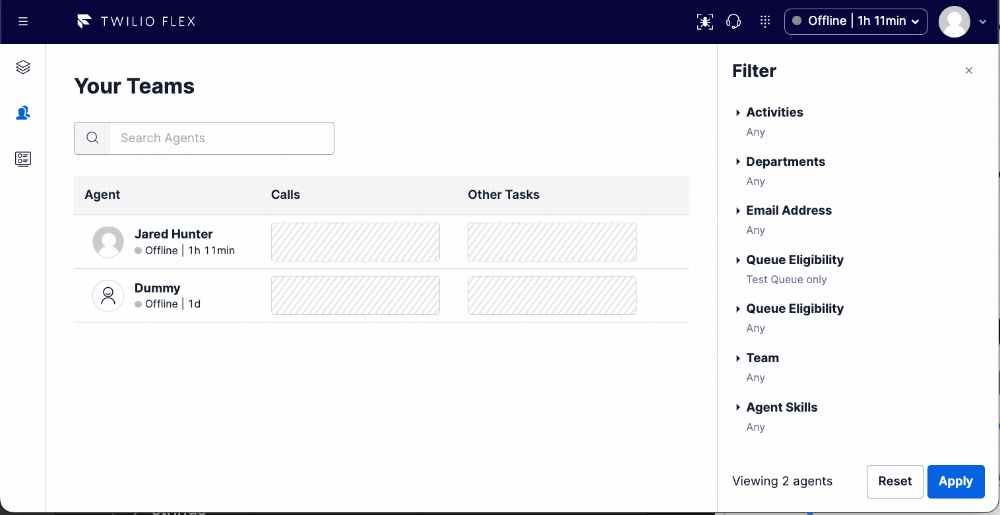

# Teams View Filters

The [Advanced Team View Filters](https://www.twilio.com/docs/flex/developer/ui/team-view-filters) provide a convenient way to add in your own filters to your Flex contact center based on your own worker attributes.

This configurable feature provides sample filters typically used in most contact centers

- Agent Skills
- Department
- Email Address
- Team
- Queue (two different solutions based on availability of a backend)

As well as sample react components to support alternative filter selection options.

- SelectFilter (configurable to a single drop down or multi select drop down)
- Free Form Text Filter

# known issues

### issue 1

Due to the way the [queue_no_worker_data](#queue-no-worker-data) filter injects multiple `data.attributes` queries into the filters array. If another filter examines the same data element, that last array item to match that element shows up for that filter. As an example (visible in [flex-user-experience](#flex-user-experience)), if a queue has an expression "routing.skills HAS 'Retention'" it will produce a filter with

```js
name: `data.atttributes.routing.skills`;
```

This is the same name used by the [agent_skills](#agentskills) filter so it shows up there.

### issue 2

For reasons yet unknown, the first time a queue is selected in the [queue_no_worker_data](#queue-no-worker-data), it disappears but when it is used again it persists.

# flex-user-experience



# setup and dependencies

To use the sample features, most of the filters can simply be toggled on in the flex-config with the exception of `queue_worker_data` which is intended for use when a solution uses it own backend to keep worker attributes updated with a list of queues. See more details in [#how does it work](#how-does-it-work)

```json
"teams_view_filters": {
        "enabled": true,
        "logFilters": true,
        "applied_filters": {
          "email": true,
          "department" : true,
          "queue_no_worker_data": true,
          "queue_worker_data": true,
          "team": true,
          "agent_skills": true
        },
        "department_options": [
          "General Management",
          "Marketing",
          "Operations",
          "Finance",
          "Sales",
          "Human Resources",
          "Purchasing",
          "Customer Service",
          "Recruiting"
        ],
        "team_options" :[
          "Blue Team",
          "Red Team",
          "Gold Team",
          "VIP Team",
          "Orange Team",
          "Yellow Team",
          "Green Team",
          "Purple Team",
          "Gray Team"
        ]
      }
```

# How does it work

## advanced filters background

The [Team View Filters](https://www.twilio.com/docs/flex/developer/ui/team-view-filters) follow the interface outlined [here.](https://www.twilio.com/docs/flex/developer/ui/team-view-filters#filterdefinition) to create a custom filter definition. Each filter when used, ultimately adds an `AppliedFilter` object to a filters array

An applied filter follows this definition example

```js
{
    name: "data.activity",
    condition: FilterConditions.IN,
    values: ["Idle"]
}
```

where each item in the `values` array is OR'd and each `AppliedFilter` in the filters array is AND'd together to perform a Live Query against the [tr-worker index](https://www.twilio.com/docs/sync/live-query#index-name)

The result set shows up as the list of agents in the team view. It is worth remembering that the live query or instance query has a max result size of 200 objects. Another restriction worth remembering is that there is a maximum query size of 50 `AppliedFilters` in the filters array.

## email

This filter simply matches against the worker attribute `email`. In Flex this is a required field to setup. The filter looks like the following

```js
{
    name: "data.attributes.email",
    condition: FilterConditions.CONTAINS,
    values: ["mysearchstring"]
}
```

## department

This filter is based on the model of the worker attibutes adopted from flex insights. A definition of that model is [here](https://www.twilio.com/docs/flex/developer/insights/enhance-integration#enhance-agent-data)

The worker attribute `department_name` may be pushed into the worker object through SSO or it may be managed directly in flex using some worker customization tool. In either case a predefined list of departments needs to be configured so that it can be selected from to search the workers with that applied department

Ideally we would be able to get a unique lit of department_names from a lookup but there is no consistent way to do this without a backend solution. If building tooling in the solution to allow supervisors the ability to edit and apply department name, synconrizing these options should be a consideration.

the filter matches against the worker attribute `department_name`. In Flex this is a required field to setup. The filter looks like the following

```js
{
    name: "data.attributes.department_name",
    condition: FilterConditions.IN,
    values: ["Department Name1", "Department Name 2"]
}
```

## queue_no_worker_data

This filter works by injecting a temporary placeholder into the filters that is then later intercepted using the [AppliedTeamViewFilters](https://assets.flex.twilio.com/docs/releases/flex-ui/2.0.0-beta.1/ui-actions/Actions#ApplyTeamsViewFilters) action hook.

At time of interception the queue expression is loaded for the identified queue and the expression is converted into a filter or set of filters. As a result this filter supports only on a subset of queues as the [interface](#advanced-filters-background) for injecting queries limits the ability to do complex queries.

- queues must use only AND'd expressions, the inclusion of any OR'd expressions will result in a notification to the user and the filter will be ignored
- expression can only use the following qualifiers: `HAS`,`==`,`EQ`,`!=`,`CONTAINS`,`IN`,`NOT IN`

A more comprehensive solution can be found by leveraging a backend to keep track of queue to worker eligibiility and keeping eligible queue sids synced on each individual worker object so it can be queried with a much simpler query filter like that in the [queue_worker_data](#queue-worker-data) filter

### queue_worker_data

This filter simply matches against the worker attribute `queues`. It is anticipated to be used when a backend solution populates a queue array on each worker that lists the queues that worker is eligible for

```js
{
    name: "data.attributes.queues",
    condition: FilterConditions.CONTAINS,
    values: ["queue sid 1", "queue sid 2"]
}
```

## team

This filter is based on the model of the worker attibutes adopted from flex insights. A definition of that model is [here](https://www.twilio.com/docs/flex/developer/insights/enhance-integration#enhance-agent-data)

The worker attribute `team_name` may be pushed into the worker object through SSO or it may be managed directly in flex using some worker customization tool. In either case a predefined list of teams needs to be configured so that it can be selected from to search the workers with that applied department

Ideally we would be able to get a unique lit of team names from a lookup but there is no consistent way to do this without a backend solution. If building tooling in the solution to allow supervisors the ability to edit and apply team names, synconrizing these options should be a consideration.

the filter matches against the worker attribute `team_name`. In Flex this is a required field to setup. The filter looks like the following

```js
{
    name: "data.attributes.team_name",
    condition: FilterConditions.IN,
    values: ["Team Name 1", "Team Name 2"]
}
```

## agent_skills

This filter is based on the skills model thats proposed by Flex. Its entirely possible a different skills model could be adopted in which case this filter would need modified appropriately.

The filter does an OR'd match on any of the selected skills. In other words, if an agent has any of the selected skills they will be returned in the search results.

The filter looks like the following

```js
{
    name: "data.attributes.routing.skills",
    condition: FilterConditions.IN,
    values: ["Skill 1", "Skill 2"]
}
```
