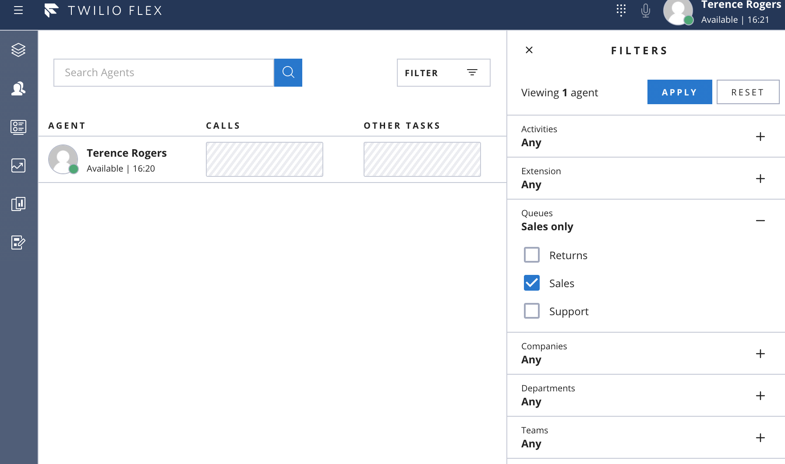
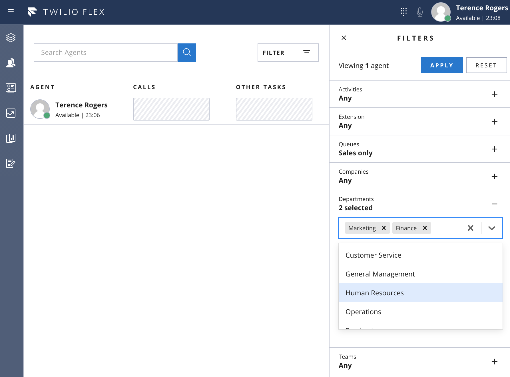

# Teams View Filters
The Twilio Flex teams view allows for real-time monitoring of Flex agents and supports filtering those agents based on Twilio TaskRouter worker attributes. This plugin provides samples for creating three types of teams view filters:

### Multi-Option Checkbox Filter

### Free Text Filter

### Autocomplete Multi-Select Filter

# Configuration

There are no dependencies for setup beyond ensuring the flag is enabled within the flex-config attributes.

# How does it work?

The Flex `TeamsView` component can be supplied custom filters via its `filters` prop. The `enabledFilters.ts` file is used to supply the filter definitions you'd like to enable.

This plugin contains several different sample filter definitions in the `filters` directory. These can be customized as needed; the provided filters are merely examples of what you could build.
