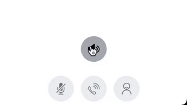
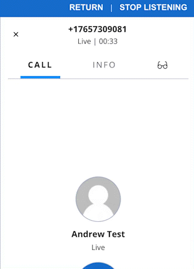

# supervisor barge coach suite

This feature provides the ability for a Supervisor to barge in to a call (IE join an active call with an agent) or coach and agent (IE talk only to the agent where the caller(s) are unable to hear you), all from the Team's View.

There are addtiional features that have been added to allow the Agent to see who is activing coaching them along with giving the Supervisor the ability to go into a "private/incognito" mode if they wish to.  The additional features require specific feature flags to be enabled, which we will review in the setup and dependencies section below.

# flex-user-experience

First select the call/worker you wish to monitor  

Click the Monitor button to enable the Barge-In Button (Middle Button) and the Coach Button (Right Button)  

Coach Status Panel to the Agent's UI.  This UI change can be enabled/disabled by the below button 

There is a private toggle to enable/disable the agent's ability to see who is coaching them  

There is also a Supervisor Monitor Panel, which gives the supervisors the ability to see if other supervisors are monitoring, coaching, or have joined (barged) the call.  **Note that the private toggle feature does apply to this feature as well.  If a Supervisor has private mode on, they will not show up in the Supervisor Monitor Panel    

# setup and dependencies

There are no dependencies for setup beyond ensuring the flag is enabled within the flex-config attributes.

To enable the standard supervisor barge coach feature, under the flex-config attributes set the supervisor_barge_coach enabled flag to true.

To enable the Coach Status Panel and Private Toggle, set the agent_coaching_panel to true

To enable the Supervisor Monitor Panel, set the supervisor_monitor_panel to true

# how does it work?

This plugin adds a barge-in and coach button to the Monitor call canvas.  You can get to this via the Team View, click on the agent you wish to monitor and the buttons will be available once you begin to monitor the live calls.  The left button is the Barge-In button which allows you to join the conference all with the agent(s) and customer(s).  Toggling this button will mute/unmute yourself.  The right button is the Coach button which allows you to talk to the agent you are monitoring.  The no other member of the call will be able to hear you except for the monitored agent.  Toggling this button enables Coach and the left button converts to a Mute/Un-Mute button for the coaching mode.

Some additional features have been added to give the ability for the agent to see who is coaching them, and the ability for the supervisor to get into a "private mode" if they wish to not be shown (this applies to both the agent coach panel and supervisor monitor panel features).  The latest version has added the ability for Supervisors to see who may be actively monitoring, coaching, and have joined (barged) the call.  See the # setup and dependancies section on enabling the additional features.

---

## Changelog

### 1.1

**August 5, 2022**

- Added Supervisor Monitor Panel to the plugin

### 1.0

**July 29, 2022**

- Migrated to PS Template, reset version to 1.0