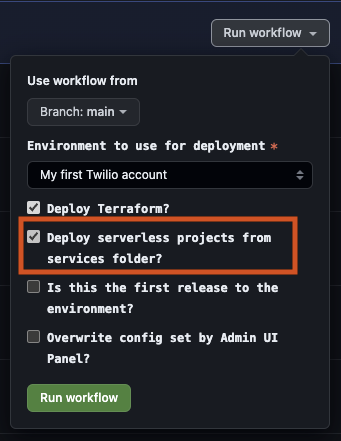

# Automatic serverless deploys



To get started with deploying your Twilio Functions along Flex Project template, all you need to do is place your project in this folder.

All projects inside this folder are analyzed and compiled into ```serverless-manifest.yaml``` by ```buildServiceManifest.js```. It detects functions in ```functions/``` folder, loads expected variables from ```.env.example```, populates them with matches from process environment, loads assets from folder set in ```.twilioserverlessrc``` and outputs everything to the manifest file.

This manifest is consumed by Terraform ```serverless-services``` module, which deploys functions, assets, dependencies and environment variables.

Before terraform deployment, each project goes under package installation (```yarn```). If there's a build command available on ```package.json```, it gets ran right after. Then, only after services are built, ```terraform apply``` takes place.  

All missing environment variables are listed on the Github action summary.

(Serverless deployed will be skipped if no service is present)