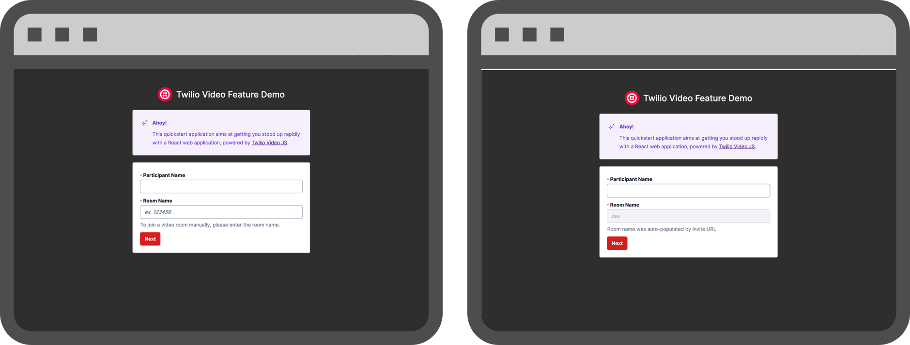
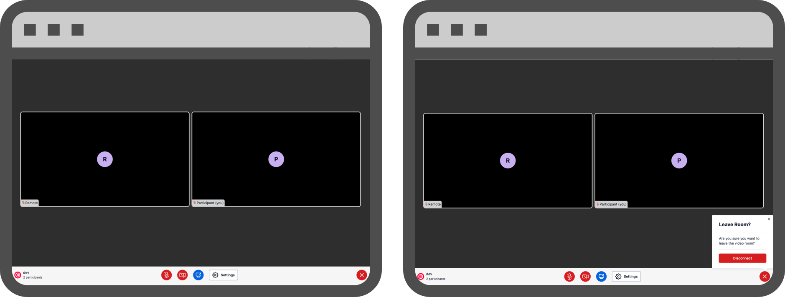

<a  href="https://www.twilio.com">

</a>

# Twilio Video - Demo PoC App

This proof-of-concept application demonstrates how you can build a video application with [Twilio Programmable Video JS SDK](https://www.twilio.com/docs/video/javascript-getting-started), [Next JS](https://nextjs.org/), and [Twilio Paste](https://paste.twilio.design/).

📝 **Note:** this application was built off the official [Twilio Paste + Next JS App](https://github.com/twilio-labs/paste/tree/main/packages/paste-nextjs-template) template.

To get up and running locally with this repository, please see the [Local Development](#local-development) section below.

---

1. [Features 🕹️](#features)
2. [What is it 🧐](#what-is-it)
   1. [Landing Screen](#landing-screen)
   2. [Pre-Join Screen](#pre-join-screen)
   3. [Active Video Room Screen](#active-video-room-screen)
   4. [Post-Video Room Screen](#post-video-room-screen)
3. [Code Organization 👾](#code-organization)
   1. [📁 pages](#pages)
   2. [📁 components](#components)
   3. [📁 lib](#lib)
   4. [📁 store](#store)
4. [Reporting & Monitoring 📊](#reporting--monitoring)
   1. [Store WebRTC Stats](#store-webrtc-stats)
   2. [Store Survey Feedback](#store-survey-feedback)
   3. [Room Status Callbacks](#room-status-callbacks)
   4. [Video Insights Event Streams](#video-insights-event-streams)
5. [Local Development 💻](#local-development)
6. [License](#license)

---

## Features

- [x] Local Permissions Checks & preemptive warnings
- [x] Preflight API check
- [x] Device configuration & local storage preferences
- [x] Mute & unmute local camera & microphone
- [x] Screensharing
- [x] Copy meeting invite link to clipboard
- [x] Dominant speaker detection
- [x] Network Quality API
- [x] Emoji Reactions using Data Tracks
- [x] Storing `WebRTC` stats using `room.getStats()`
- [x] Post-call Survey Collection

#

## What is it

The application is broken down into four distinct stages of a typical video chat experience, specifically focusing on:

### [Landing Screen](/components/screens/LandingScreen/LandingScreen.tsx)

<div style="width:100%; margin: 20px">

</div>

- The initial view that is loaded at the base URL
- Provides the ability to create or join a video room
- Form inputs for `Participant Name` (name shown in room) and `Room Name` (Twilio Video Room to join/create)
- If you append the `identity` parameter to the URL, this will auto-populate the `Participant Name` field and disable it.  
- If you append the `roomName` parameter to the URL, this will auto-populate the `Room Name` field and disable it.
- If you append both the `identity` and `roomName` parameters to the URL, this will automatically proceed to the `Pre-Join Screen`, without requiring any user input.

### [Pre-Join Screen](/components/screens/PreJoinScreen/PreJoinScreen.tsx)

<div style="width:100%; margin: 20px">

</div>

- Preview and configure local devices prior to joining the room - changes to default devices will be stored in local storage to default to preferred device IDs
- Optionally enter the video room with camera or microphone enabled/disabled
- Retrieve Access Token scoped to the Video Room name - if the room exists and is not already completed
- [Preflight API](https://www.twilio.com/docs/video/troubleshooting/preflight-api) check runs in the background when the Access Token is returned - `passed` result allows them to join the room, any failure results in disabling the `Join Room` button

### [Active Video Room Screen](/components/screens/ActiveVideoRoom/ActiveVideoRoom.tsx)

<div style="width:100%; margin: 20px">

</div>

- Shown after the `Local Participant` successfully connects to the room
- Grid-based view of the `Local` and `Remote` participants
- Room controls:
  - Toggle microphone on/off
  - Toggle camera on/off
  - Toggle screenshare on/off
  - Configure settings (local devices)
  - Emoji Reactions (using Data Tracks)
  - Copy Invite Link to clipboard
  - Disconnect from room
- Monitoring - utilizes the `getStats()` method on the `room` object to gather WebRTC statistics for the participants and sends them to a webhook for data storage (for more information, see the [Reporting & Monitoring](#reporting--monitoring) section)

### [Post-Video Room Screen](/components/screens/PostVideoRoom/PostVideoRoom.tsx)

<div style="width:100%; margin: 20px">

</div>

- The screen that displays when a participant disconnects from the video room (either manually or due to error)
- Currently allows you to redirect back to the `Landing Screen`
- **Optional**: a dedicated space in the user journey to collect survey feedback on the video experience and send to backend data storage for further analysis of performance

#

## Code Organization

The following breakdown highlights what each section of this repository is responsible for.

### [pages](./pages/)

The routes for the application based on [file-system based routing](https://nextjs.org/docs/routing/introduction) provided by the Next.js framework.

- [📁 api](./pages/api/) - the API routes for the application (e.g. Access Token generation); for more information on how API routes work with Next.js, see [this documentation](https://nextjs.org/docs/api-routes/introduction)
- [📄 \_app.tsx](./pages/_app.tsx) - the entry point for the application which contains wrapper components to setup our `Query Client` for [React Query](https://react-query-v3.tanstack.com/) and `Theme Provider` from [Twilio Paste](https://paste.twilio.design/introduction/for-engineers/manual-installation#setting-up-the-theme-provider)
- [📄 index.tsx](./pages/index.tsx) - the base route for the application (`/`); sets up the title of the web page, sets the favicon logo, and renders the [Video Provider](./components/VideoProvider/VideoProvider.tsx) component

### [components](./components/)

The user interface components that comprise the application, with a few specific callouts:

- [📁 screens](./components/screens/) - the parent components representing the four different screens outlined in the [What is it](#what-is-it) section
- [📄 VideoProvider.tsx](./components/VideoProvider/VideoProvider.tsx) - the main logic controller for determining which screen to show based on the global state store
- [📄 styled.ts](./components/styled.ts) - styled components built using the Twilio Paste styling library and CSS

### [lib](./lib/)

The utility folder of the application containing custom hooks, helper functions, middelware API, and type definitions.

- [📁 hooks](./lib/hooks/) - custom hooks used throughout the application to assist with local device gathering and track operations
- [📁 utils](./lib/utils/) - various utility functions
- [📄 api.ts](./lib/api.ts) - middleware functions setup using `axios` and `React Query` (currently only to fetch an Access Token)
- [📄 types.ts](./lib/types.ts) - type definitions

### [store](./store/)

The global state management solution to store and access information across the application. The [Zustand](https://github.com/pmndrs/zustand) library is being utilized here.

#

## Reporting & Monitoring

Reporting on video rooms is critical to understanding the performance of your application. While Twilio offers the [Video Insights Dashboard](https://www.twilio.com/docs/video/troubleshooting/insights) to view trends over time, it is valuable to develop your own data analysis workflows to understand performance at a more granular level.

Within this application, there are a few examples setup to demonstrate how this could look. Each payload is sent to webhooks configured within [RequestBin](https://requestbin.com/), but can easily be routed to whichever backend data store you choose. The core takeaway is the value in adding processes to store information about your video rooms.

### Store WebRTC Stats

While a participant is connected to a Twilio Video room ([Active Video Room](#active-video-room-screen)), the `room` object contains a [getStats()](<https://sdk.twilio.com/js/video/releases/2.3.0/docs/Room.html#:~:text=this-,getStats(),-Get%20the%20Room>) method which will return WebRTC statistics around bits sent/received, packets sent, packets lost, jitter, round trip time, etc.

Storing these statistics will help diagnose potential quality issues faced by participants and can assist in troubleshooting. For the purposes of this application, the `room.getStats()` method is called every **15 seconds**. Upon completion, the `StatsReport` is sent to a logging webhook:

```
// Ship WebRTC stats to data store
  useEffect(() => {
    const shipStats = setInterval(async () => {
      room?.getStats().then((results) => shipRoomStats(results[0]));
    }, 15000);
    return () => clearInterval(shipStats);
  }, [room]);
```

### Store Survey Feedback

After a room is completed, it is important to collect feedback on the quality of the participant's experience. Within the [Post Video Room Screen](#post-video-room-screen), if a survey webhook is provided, a simple feedback collection example is setup to gauge if the quality was good or bad. If a thumbs down is indicated, the participant can select from a list of common issues, or add in a custom response.

Once the `Submit Feedback` button is clicked, the response will be sent to another webhook along with the relevant room information:

```
const surveyPayload = {
   roomSid: room?.sid,
   roomName: formData.roomName,
   participantSid: room?.localParticipant.sid,
   participantIdentity: formData.identity,
   thumbsUpOrDown: thumb,
   issuesFaced,
   otherIssues,
};
```

The feedback can help identify a starting point for diagnosing why a participant's audio or video quality was poor.

### Room Status Callbacks

While not included directly in the code for this application, the same webhook convention (using RequestBin) has been setup to ingest [Room Status Callbacks](https://www.twilio.com/docs/video/api/status-callbacks#rooms-callbacks). These callbacks help establish a timeline of events related to Video rooms including when they start and finish, participants connecting/disconnecting, and audio/video/data track operations.

The webhook URL for Status Callbacks can be set globally within the **Video** section of the Twilio Console, or per-room via the Rest API.

### Video Insights Event Streams

This data collection strategy also is not included directly in the application, but can be setup with a webhook and some configuration within the Twilio Console. [Event Streams](https://www.twilio.com/docs/events) is in **public beta**, and contains [two events](https://www.twilio.com/docs/events/event-types#video-insights-log-analyzer) related to Video Insights:

- [Participant Summary](https://www.twilio.com/docs/video/troubleshooting/video-log-analyzer-api#participant-summary-resource-properties) - one event per participant in a video room; contains a variety of information about the participant including connection duration, platform & browser information, etc.
- [Room Summary](https://www.twilio.com/docs/video/troubleshooting/video-log-analyzer-api#room-summary-resource-properties) - one event per video room; contains room-level information including the end reason, duration, media region, etc.

Please see the [Webhook Quickstart](https://www.twilio.com/docs/events/webhook-quickstart) for more information on getting started with this approach (additional options for Amazon Kinesis and Segment).

#

## Local Development

1. After cloning the repository, install the package dependencies:

   ```
   npm install
   ```

2. Copy the `.env.example` file into a `.env` file, then populate the values with your Twilio account credentials:

   ```
   cp .env.example .env
   ```

   ```
   ACCOUNT_SID=ACxxxxxxxxxxxxxxxxx
   TWILIO_API_KEY=SKxxxxxxxxxxxxxxxxx
   TWILIO_API_SECRET=xxxxxxxxxxxxxxxxx

   # OPTIONAL - REPORTING WEBHOOK ENDPOINTS
   NEXT_PUBLIC_LOGGING_ENDPOINT=https://xxxxxxxxxxxxxxxxx
   NEXT_PUBLIC_SURVEY_ENDPOINT=https://xxxxxxxxxxxxxxxxx
   ```

3. Run the application:

   ```
   npm run dev
   ```

4. Application should be available at `http://localhost:3010/features/chat-to-video-escalation`.

   **Note:** By default, if no `?roomName=` URL Parameter is present, the user needs to enter a `Participant Name` and `Room Name` to connect to. If you append the `?roomName=test` parameter to the URL, this will autopopulate the `Room Name` field and disable it, requiring only a `Participant Name` to be entered before proceeding to the `Pre-Join Screen`. Example:

   ```
   http://localhost:3010/features/chat-to-video-escalation?roomName=test
   ```

## License

[MIT](http://www.opensource.org/licenses/mit-license.html)
