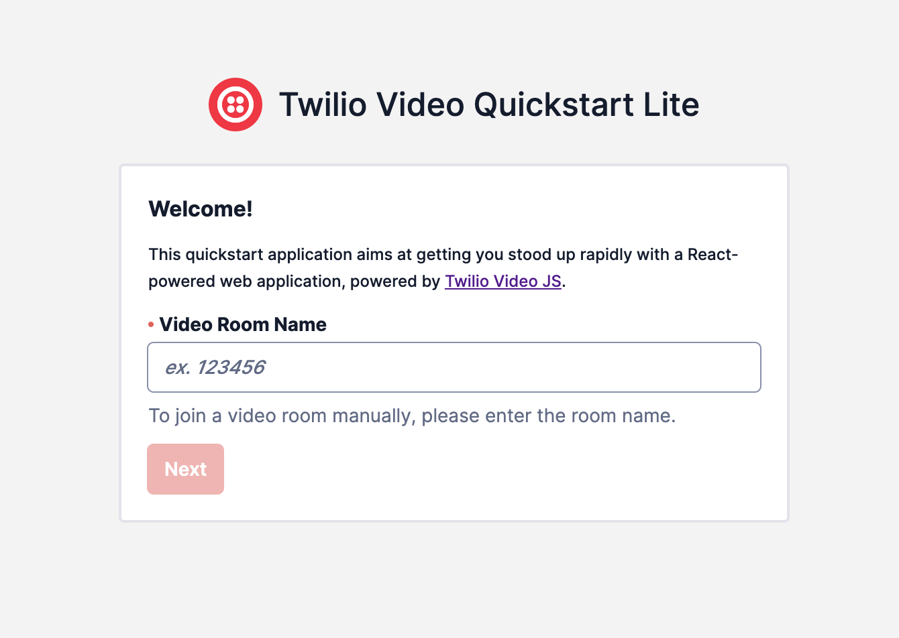

<a  href="https://www.twilio.com">

</a>

# Twilio Video - Quickstart _Lite_

This application is aimed at standing up a 1:1 video room solution rapidly, specifically build off the [Chat to Video Escalation](../../plugin-flex-ts-template-v2/src/feature-library/chat-to-video-escalation/) feature. This solution utilizes the following:

- [Twilio Video JS SDK](https://www.twilio.com/docs/video/javascript)
- [React + TypeScript](https://reactjs.org/)
- [Next JS](https://nextjs.org/)
- [Twilio Paste](https://paste.twilio.design/)

The repository was started with [this template](https://github.com/twilio-labs/paste/tree/main/packages/paste-nextjs-template) provided by [Twilio Labs](https://www.twilio.com/labs).

---

## Functionality Overview

- **Landing Screen** - the home page for the video application; allows entry of a video room name/code to join into
  
- **Pre-Session Screen** - currently shows the Video Room code prior to joining; would like to add in PreFlight checks and audio/video device configuration
  
- **Video Room UI** - shows the _remote_ and _local_ participants, with options to toggle the microphone & camera on/off, share screen, and disconnect from the room
- **Post Call UI** - an interface to display after the call has concluded or the participant leaves the room (e.g. disposition, feedback)

---

### Twilio Account Settings

Before we begin, we need to collect all the config values we need to run this quickstart app:

| Config&nbsp;Value | Description                                                                                                                          |
| :---------------- | :----------------------------------------------------------------------------------------------------------------------------------- |
| Serverless Domain | The serverless domain where your associated backend Functions are deployed to (the actual customer-facing video app is deployed here too)
| Account&nbsp;Sid  | Your primary Twilio account identifier - find this [in the Console](https://www.twilio.com/console).                                 
| Auth Token        | Used to create an API key for future CLI access to your Twilio Account - find this [in the Console](https://www.twilio.com/console). |

---

## Local Development using twilio serverless functions

After the above requirements have been met:

1. Install dependencies.

   ```bash
   npm i
   ```

2. Create a `.env` file and update the values:

   ```bash
   cp .env.example .env
   ```

   ```
   NEXT_PUBLIC_SERVERLESS_FUNCTIONS_DOMAIN=localhost:3001
   ```

3. Run the following command to build the application and automatically transfer the build output to the `../../serverless-functions/src/assets/features/chat-to-video` folder:

   ```bash
   npm run build
   ```

---

## Changelog

### 1.0.1

**June 21, 2023**

- Updated README to target steps for local development as action scripts are updated to take care of hosted deployment automatically.

### 1.0.0

**September 7, 2022**

- Updated README & initial commit into pro serv template.

## Disclaimer

This software is to be considered "sample code", a Type B Deliverable, and is delivered "as-is" to the user. Twilio bears no responsibility to support the use or implementation of this software.
